# E-Commerce Platform Frontend (Flutter + AI Chat)

[](LICENSE)

## Overview
This repository contains the **Flutter mobile frontend** for a full-stack e-commerce platform.  
It connects to a Django REST Framework backend with **AI-powered assistance** for customer support.

The Flutter app provides:

- Product browsing with filters, search, and sorting
- Shopping cart management
- Order placement and tracking
- User authentication via JWT
- Real-time AI chat powered by **SmolAgents + DeepSeek**
- Responsive design for Android and iOS devices

---

## Tech Stack

- **Framework:** Flutter 3.6+
- **State Management:** Riverpod / Hooks Riverpod
- **HTTP Requests:** Dio
- **Environment Variables:** flutter_dotenv
- **Secure Storage:** flutter_secure_storage
- **SVG & Icons:** flutter_svg, lucide_icons_flutter
- **Caching Images:** cached_network_image
- **WebSockets:** web_socket_channel
- **Dependency Injection:** Provider
- **UI Design:** Material Design
- **Fonts:** Poppins (all weights + italics)

---

## Features

### Users
- Sign up, login, logout, and refresh JWT tokens
- JWT-protected endpoints for personal actions
- Profile retrieval and updates

### Products
- Browse and search products by keyword, category, brand, or price range
- Sort by creation date, price, name, or rating
- View product details with versions, colors, and images

### Cart
- Add, remove, and update cart items
- Dynamic cart total and item count
- Clear cart contents

### Orders
- Place orders from the cart
- View order history and details
- Track order status using AI chat integration

### Reviews
- Submit product reviews after purchase
- View product reviews with ratings

### AI Chat Widget
- Ask questions about products, orders, or shipments
- Uses **SmolAgents + DeepSeek** backend agent
- Provides personalized responses using `user_id`
- Handles errors gracefully and guides users if tools fail
- Embedded FAQ knowledge: shipping, returns, orders, accounts, payments
---

## Mobile Screenshots

| Screenshot 1 | Screenshot 2 | Screenshot 3 |
|--------------|--------------|--------------|
| 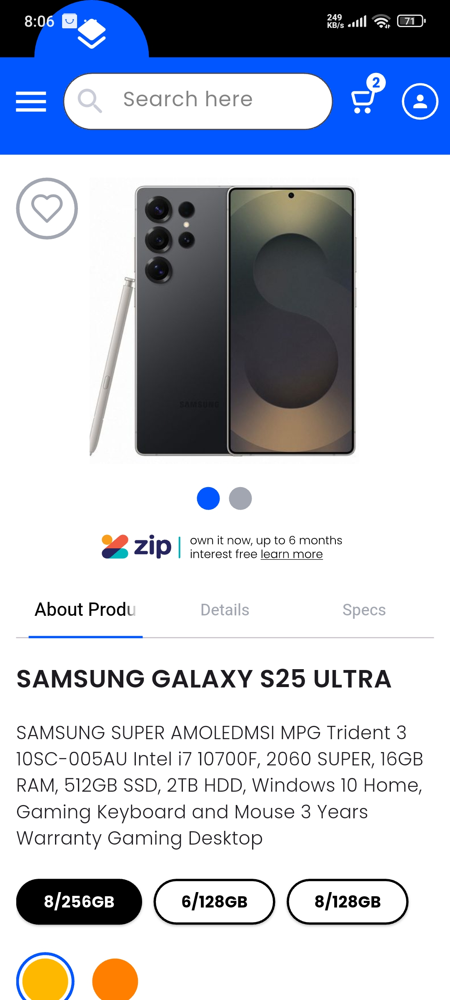 | 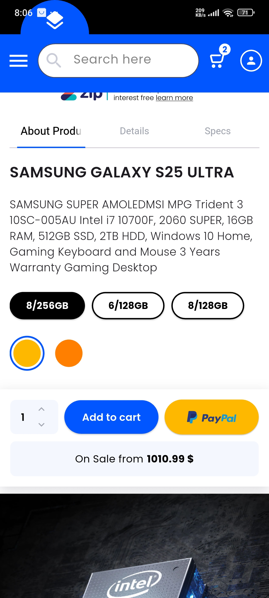 | 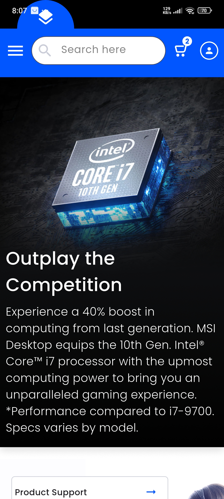 |

| Screenshot 4 | Screenshot 5 | Screenshot 6 |
|--------------|--------------|--------------|
| 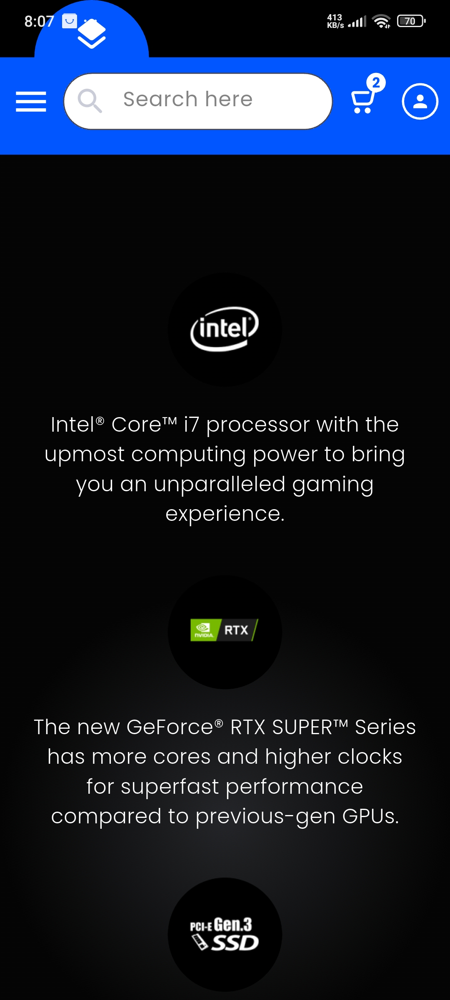 | 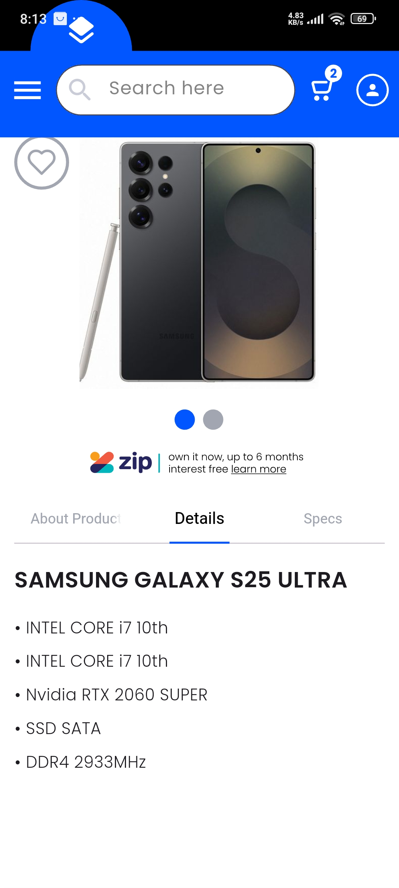 | 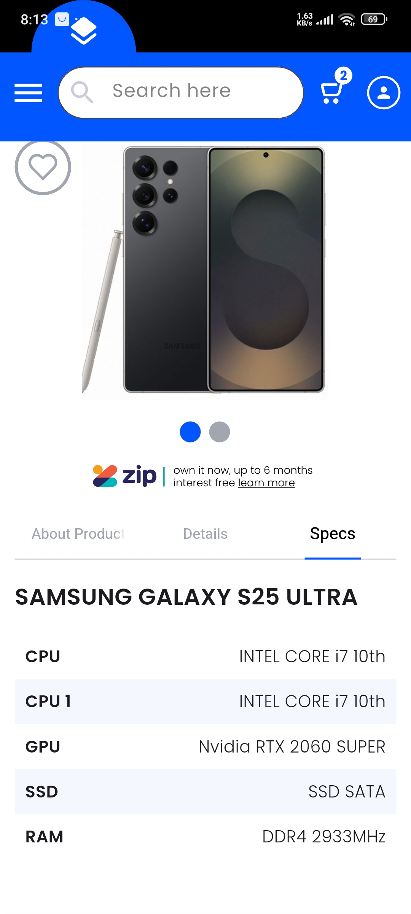 |

| Screenshot 7 | Screenshot 8 | Screenshot 9 |
|--------------|--------------|--------------|
| 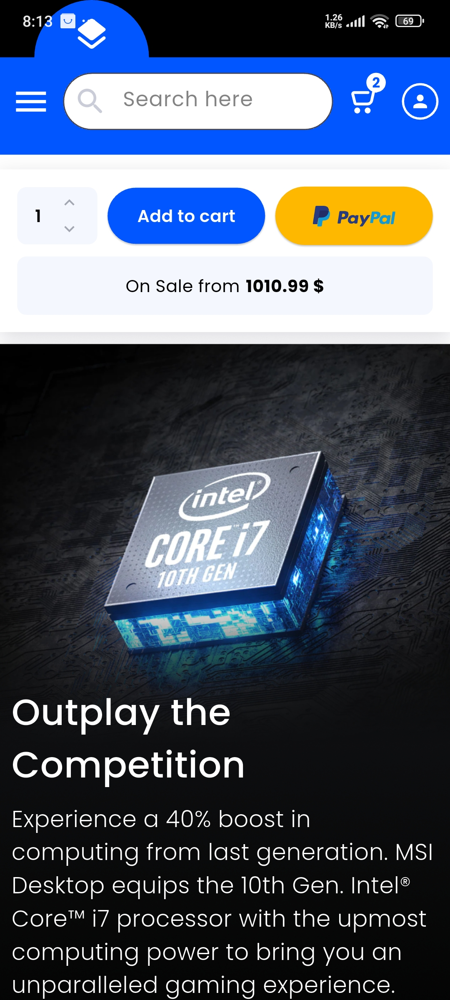 | 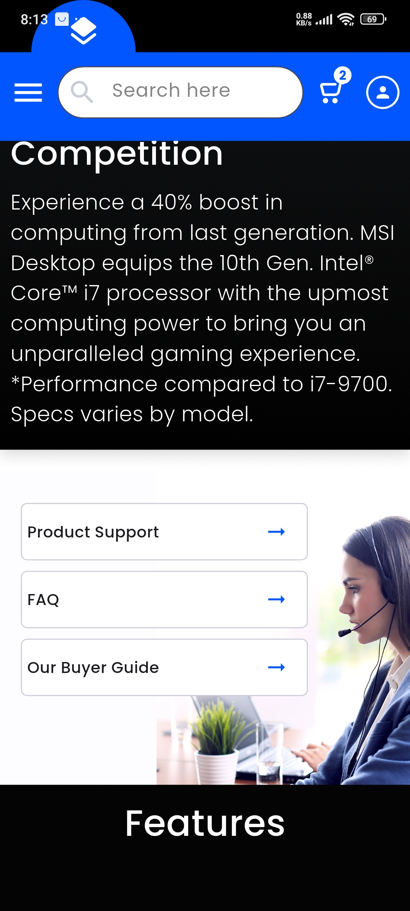 | 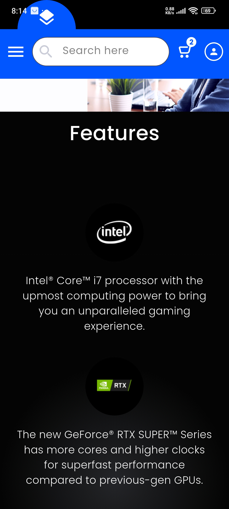 |

| Screenshot 10 | Screenshot 11 | Screenshot 12 |
|---------------|---------------|---------------|
| 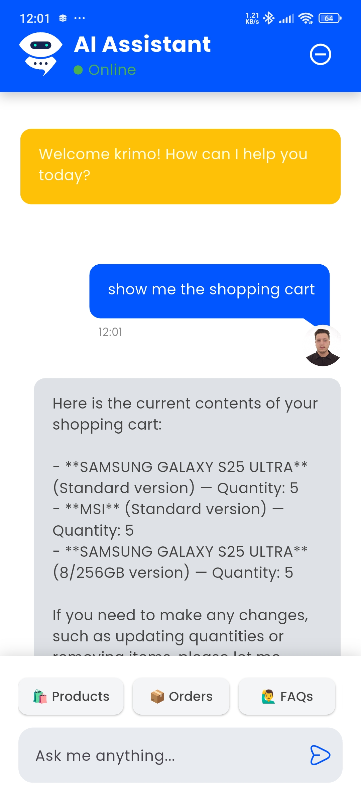 | 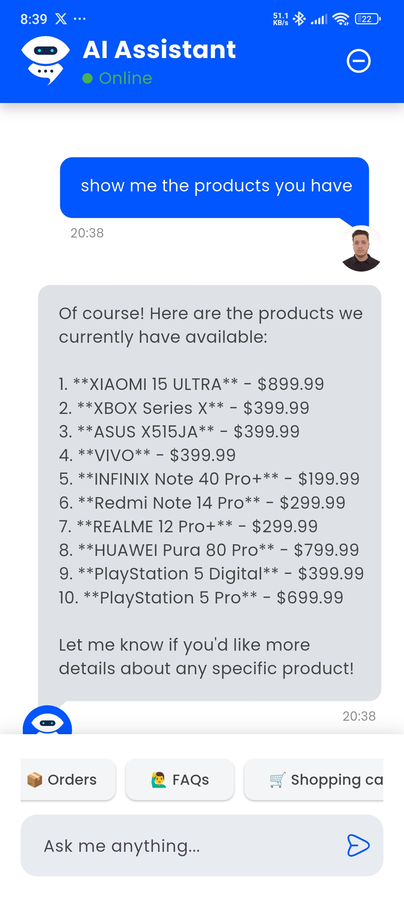 | 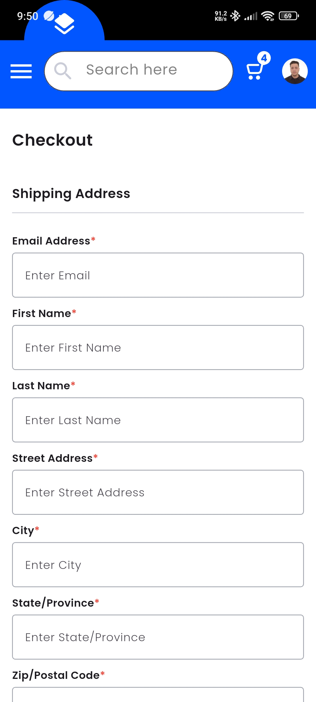 |

| Screenshot 13 | Screenshot 14 |
|---------------|---------------|
| 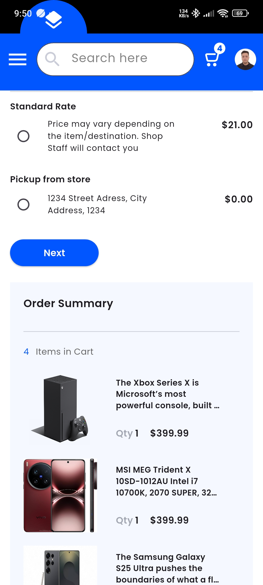 | 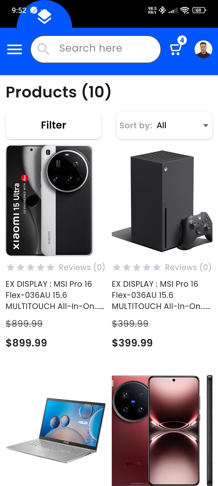 |

### Prerequisites
- Flutter 3.6+
- Dart 3.0+
- Backend server running (link to backend repo)
---

### Installation
```bash
git clone https://github.com/ZennadAkram/tech_store/
flutter pub get
cp .env.example .env
# Add your configuration to .env
flutter run

## Environment Variables
Create a `.env` file with:
BASE_URL=backend_url

